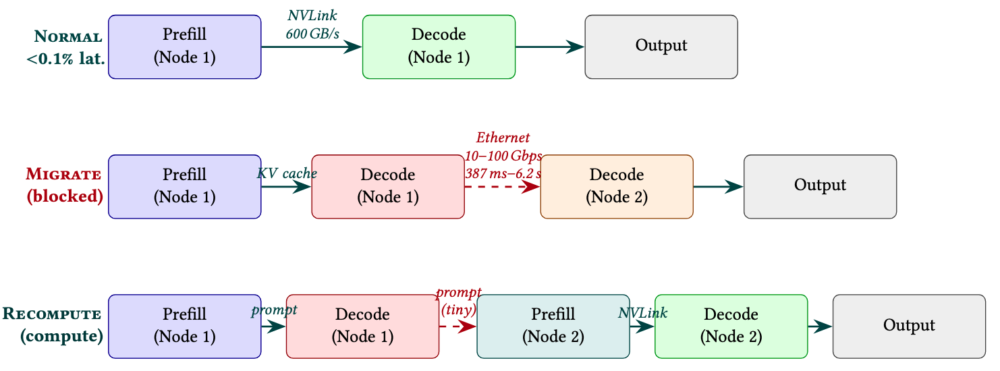
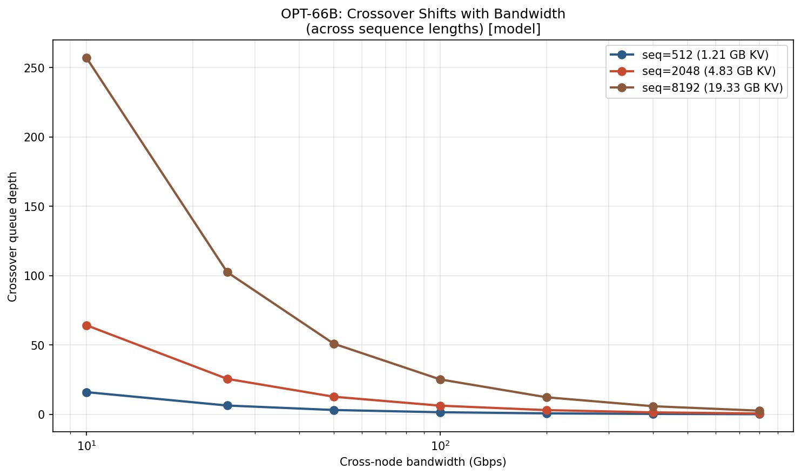
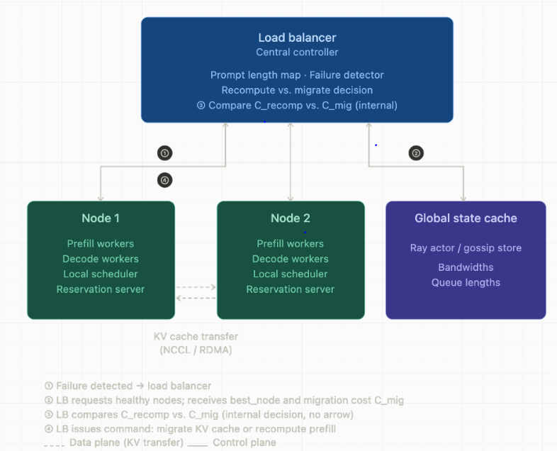
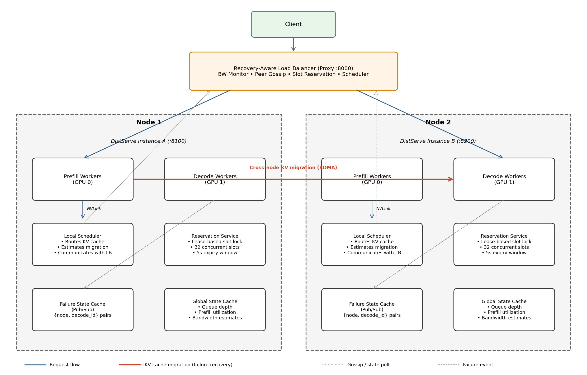
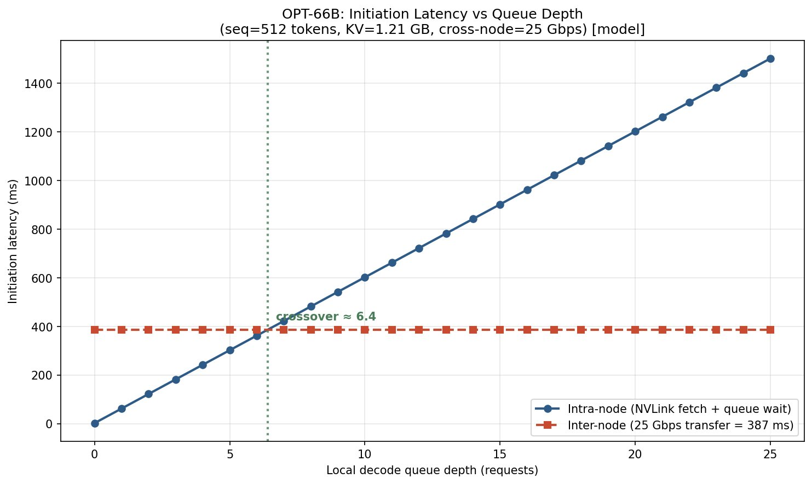
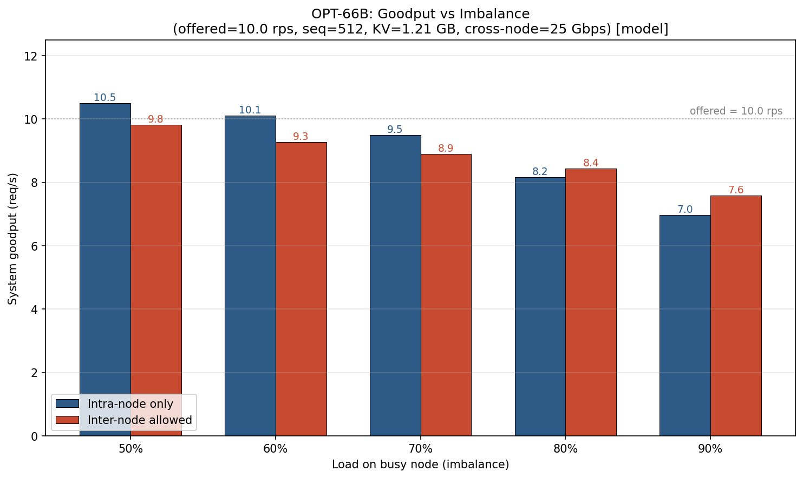

# RecompOrMigrate (KVRS)

**Network‑Aware KV Cache Recovery Scheduler for Disaggregated LLM Inference**

[](https://github.com/LLMServe/DistServe)

---

## Abstract

When a decode GPU fails in a disaggregated LLM serving system, the request must be reassigned to a different node. The system faces a choice: **migrate** the existing KV cache over the network, or **recompute** the KV cache from scratch on the new node. The optimal decision depends on dynamic network bandwidth and prompt length, yet existing systems use a static “always‑migrate” policy.

**RecompOrMigrate (KVRS)** extends DistServe with a lightweight, **network‑aware** scheduler that per‑request estimates both costs and picks the faster path. The decision is made in `O(1)` and adds zero overhead on the healthy path. On a two‑node A100 cluster, KVRS recovers up to **8.6%** of lost goodput compared to the static baseline.

---

## Problem & Approach

Disaggregated prefill‑decode architectures co‑locate paired workers on the same node so that KV cache transfer uses intra‑node NVLink (~600 GB/s). After a decode‑worker failure, however, the KV cache must cross a commodity Ethernet fabric (10–100 Gbps), inflating transfer time by 6–60×.

Two execution paths exist after a failure:

  

- **Migrate** – transfer the full KV cache from the still‑alive prefill GPU to a healthy decode GPU over Ethernet.  
  *Cost:* `C_mig = S_KV(L) / (bandwidth × 10⁶)`.
- **Recompute** – drop the KV cache and rerun prefill on a new node.  
  *Cost:* `C_recomp = T_prefill(L)`.

The crossover point where both costs are equal depends on prompt length `L` and available bandwidth `B`. It varies by **three orders of magnitude** across realistic settings, meaning no static policy can be optimal everywhere.

  
*Crossover queue depth across bandwidth and sequence length. Values range from near 0 to >250.*

---

## System Architecture

KVRS acts as a recovery‑aware proxy that sits between clients and the DistServe backends.

### Cluster‑level design

  
*Overall architecture: The load balancer detects failures, queries the local scheduler for the best remote node, compares C_recomp with C_mig, and then commands either a migrate or recompute action. A global state cache (gossip store) provides runtime bandwidths and queue lengths.*

### Proxy internal components

  
*Inside the KVRS proxy: four cooperating modules – Bandwidth Monitor (EWMA probes), Peer Gossip (periodic stats polling), Slot Reservation (limits concurrent migrations to 32), and the Recovery Scheduler (executes the decision). Two separate DistServe instances run on Node 1 and Node 2, each with a failure state cache and reservation service.*

---

## Core Decision Algorithm

```
Constants (model‑specific)
  N_LAYERS    = 40      // OPT‑13B
  N_KV_HEADS  = 40
  HEAD_DIM    = 128
  DTYPE_SIZE  = 2       // fp16 (bytes)

Pre‑profiled table (prompt length → prefill time in seconds)
  PREFILL_TABLE = { 512: 0.03, 1024: 0.06, 2048: 0.12, … }

function KV_CACHE_SIZE(prompt_len)
    return 2 × N_LAYERS × N_KV_HEADS × HEAD_DIM × prompt_len × DTYPE_SIZE

function MIGRATE_COST(prompt_len, bandwidth_mbps)
    return KV_CACHE_SIZE(prompt_len) / (bandwidth_mbps × 10⁶)

function RECOMPUTE_COST(prompt_len)
    return LINEAR_INTERPOLATE(PREFILL_TABLE, prompt_len)

function ROM_DECIDE(prompt_len, bandwidth_mbps, policy)
    C_mig   ← MIGRATE_COST(prompt_len, bandwidth_mbps)
    C_recomp ← RECOMPUTE_COST(prompt_len)

    if policy = "always_migrate":   return "migrate"
    if policy = "always_recompute": return "recompute"

    // "rom" adaptive policy: choose the cheaper path; tie → migrate
    return "migrate" if C_mig ≤ C_recomp else "recompute"
```

On a failure, KVRS also checks the remaining SLO budget and returns `ABORT` if neither path can meet the deadline.

---

## Key Evaluation Results

Experiments were run on a two‑node A100 cluster (UMass Unity) serving OPT‑13B, with cross‑node bandwidth emulated from 10 to 100 Gbps.

- The measured crossover queue depth matches the analytical model to within **2%**.  

  
*Crossover validation: intra‑node queue delay rises linearly at ~60 ms/request, while inter‑node cost stays flat at 387 ms for a 1.21 GB cache on 25 Gbps. The crossing point matches the analytical prediction.*

- Under 90% load skew, KVRS achieves **8.6% higher goodput** than the static intra‑node policy.

  
*System goodput under varying load imbalance. KVRS recovers goodput by migrating to the underutilised node, reclaiming 0.6 req/s (8.6%) at the extreme skew point.*

All overhead is confined to the failure path; the healthy path remains identical to vanilla DistServe.

---

## Getting Started

This project is built on top of **DistServe**. Please refer to the official [DistServe setup guide](https://github.com/LLMServe/DistServe#readme) for detailed environment requirements, cluster configuration, and hardware prerequisites.

1. **Clone this repository** (it already contains the DistServe code plus the RoM scheduler):
   ```bash
   git clone https://github.com/namdavid2904/RecompOrMigrate.git
   cd RecompOrMigrate
   ```

2. **Complete the DistServe installation steps** – the following commands are identical to the original DistServe workflow (skip the `git clone` step since you have already cloned this repository):
   ```bash
   # Create the conda environment
   conda env create -f environment.yml && conda activate distserve

   # Clone and build SwiftTransformer
   git clone https://github.com/LLMServe/SwiftTransformer.git
   cd SwiftTransformer && git submodule update --init --recursive
   cmake -B build && cmake --build build -j$(nproc)
   cd ..

   # Install DistServe
   pip install -e .
   ```

For launching Ray cluster, preparing the model, and running benchmarks, continue with the **[DistServe getting‑started guide](https://github.com/LLMServe/DistServe#readme)**.

---

## Citation & Acknowledgment

This project is built directly on **DistServe**. We are grateful to the original authors for their open‑source contribution.

**DistServe: Disaggregating Prefill and Decoding for Goodput‑optimized Large Language Model Serving**  
Yinmin Zhong, Shengyu Liu, Junda Chen, Jianbo Hu, Yibo Zhu, Xuanzhe Liu, Xin Jin, Hao Zhang  
*18th USENIX Symposium on Operating Systems Design and Implementation (OSDI 2024)*  
[Paper](https://www.usenix.org/conference/osdi24/presentation/zhong-yinmin) | [Code](https://github.com/LLMServe/DistServe)

```bibtex
@inproceedings{zhong2024distserve,
  author    = {Yinmin Zhong and Shengyu Liu and Junda Chen and Jianbo Hu and
               Yibo Zhu and Xuanzhe Liu and Xin Jin and Hao Zhang},
  title     = {{DistServe}: Disaggregating Prefill and Decoding for Goodput‑optimized
               Large Language Model Serving},
  booktitle = {18th USENIX Symposium on Operating Systems Design and Implementation (OSDI 24)},
  year      = {2024},
}
```

---

## License

This project inherits the **Apache License 2.0** from DistServe.

---

## Contact

For questions about the KVRS scheduler, please reach out to the authors:

- Nam Pham – `phuongnampha@umass.edu`
- Zoya Siddiqui – `zsiddiqui@umass.edu`
- Panashe Mandevbu – `pmandevbu@umass.edu`
```
